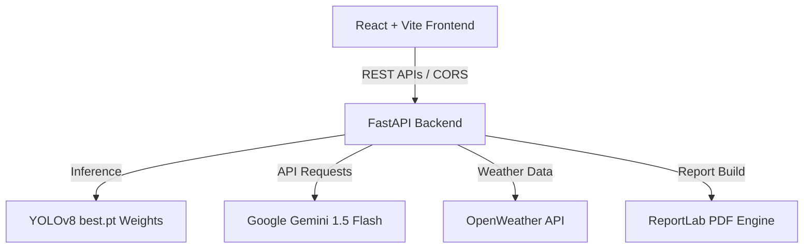

# 🌱 VerdAI - AI-Powered Crop Health & Pathology Intelligence Platform

VerdAI is a state-of-the-art agricultural diagnostic and intelligence dashboard designed to empower farmers and agronomists. It features real-time leaf pathology detection using a custom-trained YOLOv8 model, localized weather advisories, context-aware agronomic consulting powered by Gemini, and professional PDF report generation.

To support regional accessibility, VerdAI offers seamless localization in **English**, **Hindi (हिंदी)**, and **Telugu (తెలుగు)**.

---

## 🌟 Key Features

- **🔍 YOLOv8 Vision Pathology**: Instantly detect leaf diseases (like Potato Late Blight, Tomato Spot/Curl, etc.) from uploaded images or live camera captures.
- **💬 Localized Agri-Chatbot**: Get context-aware farming recommendations, disease management guidelines, and agricultural answers directly from the VerdAI bot.
- **🌤️ Smart Weather & Alarms**: Live local weather reporting paired with automated disease-risk calculations and irrigation alerts based on humidity and heat index.
- **📋 PDF Report Generator**: Generate and download comprehensive, beautifully formatted agronomic PDF health reports on detected diseases.
- **🌐 Full Localization**: Multi-lingual interface supporting English, Hindi, and Telugu with automatic translations.
- **📊 Interactive Analytics**: Keep track of diagnosis history, severity levels, and regional stress alerts through clear dashboard visualizations.

---

## 🛠️ Architecture & Tech Stack



### Frontend
- **Framework**: React.js with Vite (Fast HMR)
- **Styling**: Modern Glassmorphic CSS UI (Vanilla CSS + custom `.glass-panel` utilities)
- **Icons**: React Icons (Fa, Md, Io) & Lucide Icons
- **Visuals**: Recharts (for analytics and history visualization)

### Backend
- **Framework**: FastAPI (Asynchronous REST API, Python)
- **Object Detection**: Ultralytics YOLOv8 PyTorch model
- **Language Models**: Google Gemini API via `google.generativeai` SDK
- **Environment**: Configured via `.env` (using python-dotenv)
- **PDF Engine**: ReportLab

---

## 🚀 Quick Start Guide

### Prerequisites
- Python 3.9+
- Node.js 18+
- npm or yarn

---

### 1. Backend Configuration & Setup

1. **Navigate to the backend folder**:
   ```bash
   cd backend
   ```

2. **Set up virtual environment & activate**:
   * **Windows**:
     ```bash
     python -m venv venv
     venv\Scripts\activate
     ```
   * **macOS/Linux**:
     ```bash
     python3 -m venv venv
     source venv/bin/activate
     ```

3. **Install dependencies**:
   ```bash
   pip install -r requirements.txt
   ```

4. **Environment Configuration**:
   Create a `.env` file inside the `backend` folder and add your Google Gemini API key:
   ```env
   GEMINI_API_KEY=your_gemini_api_key_here
   ```

5. **Run the FastAPI development server**:
   ```bash
   python -m uvicorn app:app --reload
   ```
   *The API will be available at:* `http://127.0.0.1:8000`
   *Interactive API Docs (Swagger):* `http://127.0.0.1:8000/docs`

---

### 2. Frontend Configuration & Setup

1. **Navigate to the frontend folder**:
   ```bash
   cd frontend
   ```

2. **Install Node dependencies**:
   ```bash
   npm install
   ```

3. **Run the Vite development server**:
   ```bash
   npm run dev
   ```
   *The web application will open at:* `http://localhost:5173`

---

## 📊 Dataset Structure & YOLOv8 Training

To customize or retrain the leaf disease detection model:

### 1. Dataset Directory Layout
Create a `/dataset` folder in the project root with your annotated images in YOLO format:
```
dataset/
├── data.yaml                 <- Categories configuration (Tomato___Healthy, Potato___Late_blight, etc.)
├── train/
│   ├── images/               <- Training set images
│   └── labels/               <- YOLO format label text files (.txt)
└── val/
    ├── images/               <- Validation set images
    └── labels/               <- YOLO format label text files (.txt)
```

### 2. Run Training Command
Install the `ultralytics` library and train the model using a shell command:
```bash
yolo task=detect mode=train model=yolov8n.pt data=dataset/data.yaml epochs=50 imgsz=640
```

### 3. Deploy New Weights
Copy your newly trained weights file from `runs/detect/train/weights/best.pt` to the `backend/weights/best.pt` directory. Restart the FastAPI server to load the new weights automatically.

---

## 📂 Codebase Structure

```
├── backend/
│   ├── app.py                # FastAPI main application endpoints
│   ├── chatbot.py            # Gemini integration and mock fallback logic
│   ├── config.py             # System path configs and thresholds
│   ├── disease_detect.py     # YOLOv8 inference wrapper
│   ├── recommendation_engine.py # Agronomic static fallback database
│   ├── report_generator.py   # ReportLab PDF report generation
│   ├── translator.py         # Google Translate API connector
│   ├── weather_service.py    # OpenWeather weather API & alert rules
│   ├── weights/              # YOLOv8 weights (best.pt)
│   └── requirements.txt      # Python dependencies
├── frontend/
│   ├── src/
│   │   ├── components/       # UI Components (Dashboard, Chat, Camera, Weather)
│   │   ├── translations.js   # Localization mapping (EN, HI, TE)
│   │   ├── App.jsx           # Main React App layout
│   │   └── main.jsx          # Vite React entry point
│   ├── index.html            # App root HTML
│   └── package.json          # Node dependencies
└── README.md                 # Project documentation
```

---

## 📄 License
This project is open-source and available under the MIT License.
